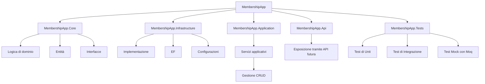

```mermaid
graph TD
    A[MembershipApp] --> B[MembershipApp.Core]
    A --> C[MembershipApp.Infrastructure]
    A --> D[MembershipApp.Application]
    A --> E[MembershipApp.Api]
    A --> O[MembershipApp.Tests]
    B --> F[Logica di dominio]
    B --> G[Entità]
    B --> H[Interfacce]
    C --> I[Implementazione]
    C --> J[EF]
    C --> K[Configurazioni]
    D --> L[Servizi applicativi]
    L --> M[Gestione CRUD]
    E --> N[Esposizione tramite API futura]
    O --> P[Test di Unit]
    O --> Q[Test di Integrazione]
    O --> R[Test Mock con Moq]
```