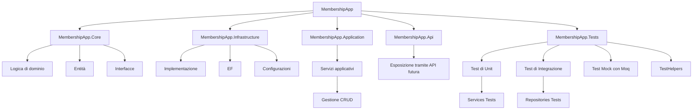
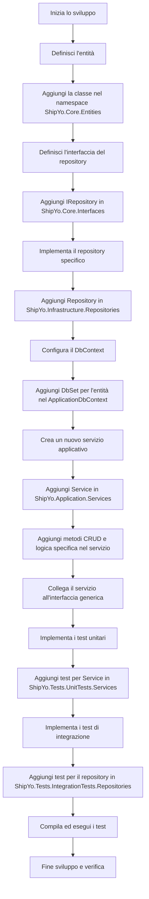

# Architettura

```mermaid
 graph TD
   A[MembershipApp] --> B[MembershipApp.Core]
   A --> C[MembershipApp.Infrastructure]
   A --> D[MembershipApp.Application]
   A --> E[MembershipApp.Api]
   A --> O[MembershipApp.Tests]
   B --> F[Logica di dominio]
   B --> G[Entità]
   B --> H[Interfacce]
   C --> I[Implementazione]
   C --> J[EF]
   C --> K[Configurazioni]
   D --> L[Servizi applicativi]
   L --> M[Gestione CRUD]
   E --> N[Esposizione tramite API futura]
   O --> P[Test di Unit]
   P --> S[Services Tests]
   O --> Q[Test di Integrazione]
   Q --> T[Repositories Tests]
   O --> R[Test Mock con Moq]
   O --> U[TestHelpers]
```
# Caso d'uso "Aggiungere una nuova entità"

```mermaid
graph TD
    A[Inizia lo sviluppo] --> B[Definisci l'entità]
    B --> C[Aggiungi la classe nel namespace ShipYo.Core.Entities]
    C --> D[Definisci l'interfaccia del repository]
    D --> E[Aggiungi I<NomeEntità>Repository in ShipYo.Core.Interfaces]
    E --> F[Implementa il repository specifico]
    F --> G[Aggiungi <NomeEntità>Repository in ShipYo.Infrastructure.Repositories]
    G --> H[Configura il DbContext]
    H --> I[Aggiungi DbSet per l'entità nel ApplicationDbContext]
    I --> J[Crea un nuovo servizio applicativo]
    J --> K[Aggiungi <NomeEntità>Service in ShipYo.Application.Services]
    K --> L[Aggiungi metodi CRUD e logica specifica nel servizio]
    L --> M[Collega il servizio all'interfaccia generica]
    M --> N[Implementa i test unitari]
    N --> O[Aggiungi test per <NomeEntità>Service in ShipYo.Tests.UnitTests.Services]
    O --> P[Implementa i test di integrazione]
    P --> Q[Aggiungi test per il repository in ShipYo.Tests.IntegrationTests.Repositories]
    Q --> R[Compila ed esegui i test]
    R --> S[Fine sviluppo e verifica]
```